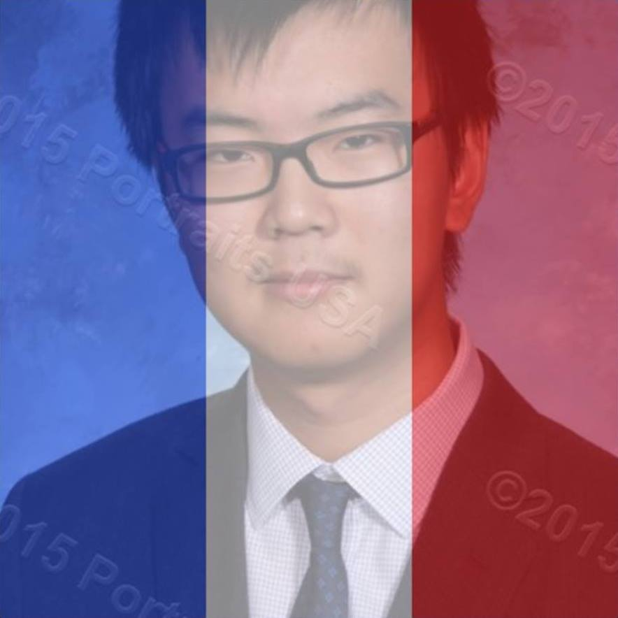

# Calender-based Club Management System

##General Proposal:

##Timeline:

##ChangeList:
- (Shawn) 05/11/16: Made readme skeleton

## Contributors
|**Profile Picture**|    **Name**    |    **Role**    |    **Github**    |
|-------------------|:--------------:|:--------------:|:----------------:|
||Albert Mokrejs|Back End|[@AlbertMokrejs](https://github.com/AlbertMokrejs/)|
||Shawn Li|Front End|[@TyranitarShawn](https://github.com/TyranitarShawn/)|
||Derry|Middleware|[@Ericil](https://github.com/Ericil/)|
||Sarah Joseph|Front/Middle|[@sarahjoseph723](https://github.com/sarahjoseph723/)|
